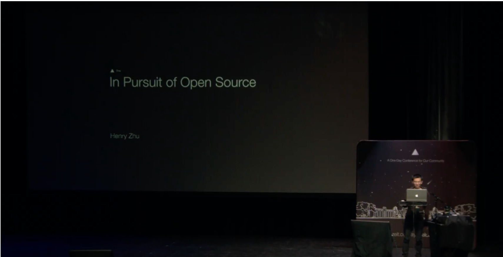

# [Zeit Day SF 2018](https://zeit.co/day)

## [Slides](http://henryzoo.com/in-pursuit-of-open-source/)

## [Stream Link](https://www.pscp.tv/zeithq/1BRKjrvoyYZKw?t=36m19s) 20min

## Video TBD

## Other Related Talks

- JSConf EU 2017: https://github.com/hzoo/maintaining-an-oss-project
- React Rally 2017: https://github.com/hzoo/so-how-does-babel-even-work
- React Boston 2017: https://github.com/hzoo/maintainer-heal-thyself

## Getting involved in Babel
- [Babel Org on Github](https://github.com/babel)
- [Babel Proposals Repo](https://github.com/babel/proposals)
- [Babel Meeting Notes](https://github.com/babel/notes)
- [Babel Website Repo](https://github.com/babel/website)
- [Babel Twitter](https://twitter.com/babeljs)
- [Slack sign-up](slack.babeljs.io)
